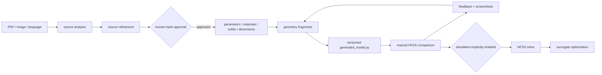

# 系统架构

LEAM Opt MCP 把“看图后直接操作仿真器”拆成可审查、可恢复、可版本控制的阶段。核心产物不是
某一台机器上的 `.aedt` 文件，而是证据、假设、几何代码和反馈记录。

## 模块边界

| 模块 | 职责 | 是否启动 AEDT |
| --- | --- | --- |
| `modeling.py` | 分阶段生成证据和几何片段 | 否 |
| `source_refinement.py` | 图文校正、证据绑定和源审核哈希 | 否 |
| `reviewed_model.py` | 独立管理未公开参数的工程假设 | 否 |
| `codegen.py` | 导出不可变版本的 `generated_model_vNNN.py` | 否 |
| `feedback.py` | 冻结用户对照意见并生成下一版本 | 否 |
| `execution.py` | 审核后把工件应用到 HFSS | 是 |
| `optimizer.py` | 复制工程、求解、记录试验并保存最优工程 | 是 |
| `pipeline.py` | 编排完整状态机 | 仅在 build/optimize 阶段 |
| `server.py` | 暴露 MCP 工具 | 取决于被调用工具 |
| `workflow_cli.py` | 暴露等价命令行入口 | 取决于子命令 |

## 数据布局

每个任务位于 `ANTENNA_MCP_WORKSPACE/<job-id>/`。`state.json` 是状态索引，其他 JSON/Python
文件是可独立检查的工件。所有写入均限制在任务目录，用户附件只读取不改写；反馈附件会复制并
记录 SHA-256。默认工作区 `.antenna-mcp/` 被 Git 忽略。

## 三个执行门

1. 图文识别结果必须经过源审核哈希，未经批准不能进入后续证据驱动建模。
2. 可执行 Python 工件必须经过最终内容哈希；修改任何工件都会使旧哈希失效。
3. HFSS 求解和优化还要求 `ANTENNA_MCP_ALLOW_SIMULATION=1`。

AST 检查和哈希门用于降低误执行风险，但生成代码不是安全沙箱。执行前仍需工程师检查几何、
材料、端口、边界、网格、频扫和制造约束。

## 扩展新案例

新天线不应写入核心代码中的 case 分支。通用路径通过源证据和 LLM 阶段生成几何。只有需要完全
确定性回归的结构才增加 compiler profile；同时提供证据/假设 JSON、import-safe Python、AEDT
wrapper 和不依赖许可证的测试。
