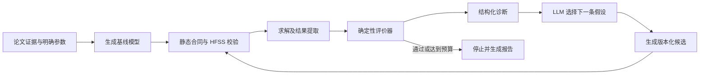

# 基于仿真反馈的迭代复现框架

## 1. 研究问题

论文通常只公开主要尺寸、材料与结果曲线，不会完整公开端口、边界、网格、绝对坐标和求解器细节。因此，单次生成是否成功不能充分评价 LLM 的论文复现能力。

本项目将问题定义为：

> 在不修改论文明确参数的前提下，LLM 能否利用可追溯的领域先验、HFSS 诊断和前一轮结果，逐步补全未披露的实现细节，并得到满足论文电磁门槛的模型？

评价对象包括首次复现能力、诊断能力、迭代效率和最终结果，不只统计一次成功率。

## 2. 一轮闭环



每轮输入不是一句新的人工 prompt，而是系统自动组装的结构化上下文：

- 冻结的论文证据、明确参数及其哈希；
- 当前工程假设及来源状态；
- 本轮构建、校验、收敛和 S 参数结果；
- 与论文目标之间的数值差异；
- 历史尝试及已排除的假设；
- 本轮允许修改的字段、范围和计算预算。

LLM 负责提出解释和选择下一项试验。几何合同、参数保护、求解、评分和停止条件由确定性程序执行。

## 3. 三类反馈

| 反馈类别 | 例子 | 处理方式 |
|---|---|---|
| 构建错误 | PyAEDT API 参数错误、对象缺失、布尔失败 | 修正代码实现，保持物理模型不变 |
| 物理诊断 | 未谐振、频率偏移、匹配深度不足、端口模态异常 | 在未披露假设空间中提出下一轮候选 |
| 来源冲突 | 图和表不一致、设计版本混淆、单位或符号歧义 | 回到来源审核，形成新证据版本并要求人工批准 |

三类反馈不能混用。例如 API 修复不能改变天线尺寸；曲线不匹配不能自动改写论文表格值。

## 4. 领域先验的形式

领域先验不直接写成“正确答案”，而应写成带适用条件的候选规则：

```json
{
  "hypothesis_id": "microstrip_wave_port_reference_plane",
  "applies_when": ["feed_type=microstrip", "port_type=wave_port"],
  "modifiable_fields": ["port_cross_section", "deembed_distance"],
  "forbidden_fields": ["paper_dimensions", "paper_materials"],
  "diagnostic_signals": ["large_reactance", "mode_field_not_quasi_tem"],
  "test_strategy": "one_factor_or_bounded_grid",
  "evidence_required_for_adoption": ["converged", "improves_full_paper_metric"]
}
```

优先覆盖常见但经常不在论文中说明的内容：

1. 端口类型、截面、积分线、参考面和去嵌；
2. 开放边界类型及与结构的距离；
3. 金属的有限厚度、薄层和表面阻抗表示；
4. 图形绝对定位、层间对齐和馈线外段长度；
5. 网格、求解频率、扫频方式和收敛条件；
6. 连接器、焊料、胶层等是否属于原始仿真版本。

## 5. 每轮输出合同

每个候选必须生成不可覆盖的记录：

- `iteration_vNNN.json`：父版本、修改字段、修改理由、先验 ID、预期影响；
- `build_receipt_vNNN.json`：几何、材料、端口和边界签名；
- `solver_receipt_vNNN.json`：AEDT/PyAEDT 版本、收敛数据和错误分类；
- `s11_vNNN.csv`：原始数值曲线；
- `evaluation_vNNN.json`：论文门槛、误差、通过状态；
- `diagnosis_vNNN.json`：下一轮可检验假设及置信度；
- `iteration_summary_vNNN.md`：供人工审查的简报。

修改论文明确参数、引用不存在的证据、未收敛或基础设施失败的尝试，不得参与物理排名。

## 6. 停止条件

满足任一条件即停止：

1. 完整论文门槛通过；
2. 达到预设迭代次数或求解预算；
3. 所有允许的未披露假设均已测试；
4. 连续若干轮无实质改善；
5. 下一步需要修改论文明确参数或引入没有来源支持的结构；
6. 多组不同假设都能拟合同一曲线，模型不可辨识，需要新的来源证据。

停止报告应说明“成功复现”“在预算内未复现”或“证据不足导致不可辨识”，不能把最接近的失败结果标为正确。

## 7. 评价指标

### 7.1 来源与约束

- 论文参数保留率；
- 无证据修改次数；
- 每个新增假设的可追溯率；
- 来源冲突识别准确率。

### 7.2 首次复现

- 首轮构建成功率；
- 首轮求解及收敛率；
- 首轮论文门槛通过率。

### 7.3 迭代能力

- 最终论文门槛通过率；
- 达到通过所需的求解轮数；
- 每轮目标误差下降量；
- 有效诊断比例；
- 重复或被前轮排除的尝试比例；
- 单次复现的求解时间和计算成本。

### 7.4 结果可信度

- 多次独立运行是否得到相同假设和结论；
- 留出案例上的成功率；
- 消融实验：移除领域先验、移除仿真反馈、移除历史记忆后的变化；
- 与人工专家迭代次数、最终误差和假设质量的对比。

## 8. 防止对曲线过拟合

- 论文明确尺寸和材料默认冻结；
- 调参范围只来自未披露字段及领域规则；
- 评价完整频带、带边、多个谐振和带内最差点，不能只优化一个最低点；
- 先固定假设空间和停止条件，再运行案例；
- 采用训练案例形成规则库，以未参与规则制定的论文作为测试集；
- 保存全部失败轮次，不只展示最好结果；
- 曲线相似但物理结构不唯一时，结论标为不可辨识。

## 9. 与当前系统的对应关系

当前已有：来源冻结、人工反馈版本、失败阶段重试、确定性合同、HFSS 收敛与论文门槛、
版本化工程假设搜索、结构化诊断、领域先验库和可恢复的自动迭代控制器。

自动控制器只执行诊断器选中的精确 trial ID；每次完成后读取哈希核对过的 S11 曲线并生成
下一版诊断。达到论文门槛、预算上限、假设耗尽或执行失败时停止。重复运行会从现有账本恢复，
不会重复求解已经完成的候选。求解前会创建当前设计唯一的本地 AEDT 结果目录，避免新设计首次
求解时因结果子目录缺失出现 WinError 5；不会删除或清理其他设计目录。

仍需继续验证：

1. 在相同冻结案例上比较一次生成、人工迭代和自动迭代；
2. 在未参与先验编写的留出论文上测试泛化能力；
3. 标定停滞阈值、计算预算和不可辨识判据；
4. 对领域先验库做消融和专家审查。

一个案例只有在目标曲线、有限假设空间和执行适配器均已冻结后，才适合进入自动迭代。
案例特有的参数、结果与本机求解目录不属于系统发行内容，应在独立实验记录中保存。

## 10. 当前命令行入口

第一版诊断与候选选择已经接入工作流：

```powershell
antenna-workflow iteration-propose `
  --curve ".\path\to\existing_s11_and_impedance.csv" `
  --target ".\path\to\iterative_target.json" `
  --space ".\path\to\assumption_space.json" `
  --output-dir ".\path\to\local_results\iterative_reconstruction_v1"
```

该命令不启动 AEDT。它读取已有曲线，写入不可覆盖的 `diagnosis_vNNN.json` 和
`iteration_vNNN.json`，并从现有 assumption space 中选择一个尚未尝试的候选。目标文件和
假设空间的 SHA-256 在首次运行后冻结；若原地改写任一输入，后续轮次会拒绝追加，应建立新的
输出目录和版本。

现有负对照通过 `previously_tested_assumptions` 注册，候选选择器不会重复安排已经完成的试验。
案例目标、假设空间和适配器由研究者在案例目录中单独维护，不应把本机求解产物提交到系统仓库。

诊断器选出的 trial 可以精确执行：

```powershell
antenna-workflow assumption-run `
  --space ".\path\to\assumption_space.json" `
  --adapter ".\path\to\assumption_adapter.py" `
  --output-dir ".\path\to\iterative_assumption_study" `
  --grpc-port 50051 `
  --active-project <open-aedt-project> `
  --aedt-version 2025.1 `
  --trial-id <proposed-trial-id> `
  --resume
```

适配器应从空设计构造候选，不修改基线设计；论文明确的尺寸和材料值由 adapter 合同与
assumption space 双重核对。

## 11. 自动闭环入口

完整闭环使用一条命令：

```powershell
antenna-workflow iteration-run `
  --curve ".\path\to\baseline_s11.csv" `
  --target ".\path\to\iterative_target.json" `
  --space ".\path\to\assumption_space.json" `
  --adapter ".\path\to\assumption_adapter.py" `
  --output-dir ".\path\to\iterative_reconstruction" `
  --study-output-dir ".\path\to\iterative_assumption_study" `
  --grpc-port 50051 `
  --active-project <open-aedt-project> `
  --aedt-version 2025.1
```

`--output-dir` 保存诊断、候选选择和最终报告；`--study-output-dir` 保存构建回执、求解结果及
原始 S11 曲线。若最近一次 trial 因许可证或基础设施问题失败，人工排除原因后可加
`--retry-failed`，新结果会追加版本，不覆盖旧失败记录。

控制器最终生成：

- `iteration_report_vNNN.json`：机器可读状态、冻结输入哈希、基准指标、全部 trial 和排名；
- `iteration_report_vNNN.md`：供人工审核的汇总表和结论边界。

“假设耗尽但未通过”是有效实验结论，不按程序错误处理；报告只说明冻结目标与有界假设空间内
没有通过候选，不证明论文错误，也不允许系统自动修改论文明确参数。
